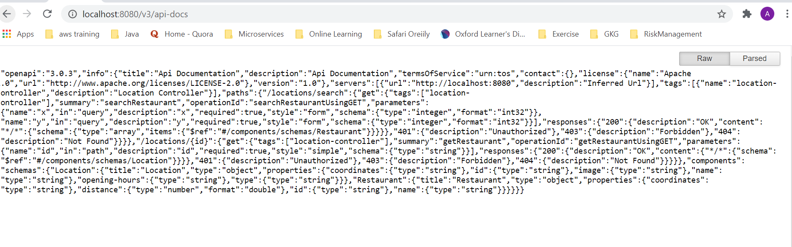

# Bonial Challenge
To launch Swagger UI start Spring Boot Application: **com.bonial.challenge.Application**
``
1. Launch Swagger UI from: http://localhost:8080/swagger-ui/#
    
    
    
2. Get Open API Specification (Swagger Spec) from http://localhost:8080/v3/api-docs

        
    
3. In a project, File is read and put in a stream. When getting and searching, parallel stream is used.
While comparing distance and radius at searching, distance is calculated once and put in a map. After that, 
get distance value from map while returning to controller. 